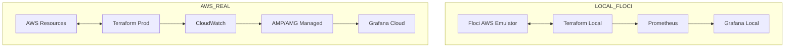

# Terraform AWS Provisioner

## Arquitetura de Observabilidade
Esta infraestrutura suporta tanto desenvolvimento local (via Floci) quanto produção (AWS Real).

## Acesso aos Serviços (Local)
Após rodar o script de início, os serviços estarão disponíveis em:
- **Floci (AWS Mock):** http://localhost:4568
- **Grafana:** http://localhost:3002
- **Prometheus:** http://localhost:9092
