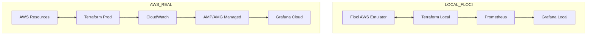

# Terraform AWS Provisioner

## Arquitetura de Observabilidade
Esta infraestrutura suporta tanto desenvolvimento local (via Floci) quanto produção (AWS Real).

```mermaid
graph TD
    subgraph LOCAL_FLOCI
    Floci[Floci AWS Emulator] <--> TF1[Terraform Local]
    TF1 --> Prom[Prometheus] --> Graf[Grafana Local]
    end

    subgraph AWS_REAL
    AWS[AWS Resources] <--> TF2[Terraform Prod]
    TF2 --> CW[CloudWatch] --> Managed[AMP/AMG Managed] --> GrafCloud[Grafana Cloud]
    end
```
